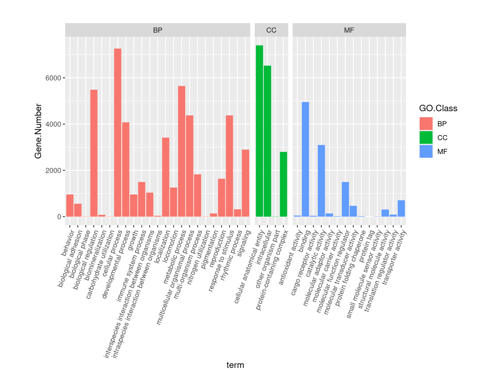
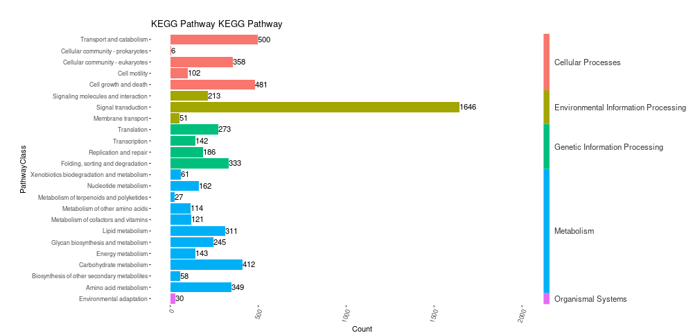

# Genome Annotation Report

**Project:** CGBIH240109
**Author:** Cristian Gallardo-Escárate
**Date:** 02/06/2024

*Markdown conversion of [CGBIH240109_Genome_Annotation-Report.pdf](CGBIH240109_Genome_Annotation-Report.pdf).*

---

## Table of Contents

1. [Analysis Results](#1-analysis-results)
   - [1.1 Genomic Information](#11-genomic-information)
   - [1.2 Repeat Annotation](#12-repeat-annotation)
   - [1.3 Non-coding RNA Annotation](#13-non-coding-rna-annotation)
   - [1.4 Structure Annotation](#14-structure-annotation)
   - [1.5 Functional Annotation](#15-functional-annotation)
2. [Reference](#2-reference)

---

## 1. Analysis Results

### 1.1 Genomic Information

The genome provided is the assembly result of two haplotypes. The statistics of the two initial assembly results are as follows:

**Table 1. Statistics of initial assembly result**

| | Och_HapA_assembly | Och_HapB_assembly |
|---|---|---|
| Sequence Number (bp): | 10 | 10 |
| Total nucliotide (bp): | 789,630,056 | 1,131,963,527 |
| Avg. Length (bp): | 78,963,005.6 | 113,196,353 |
| Max length (bp): | 100,680,956 | 139,369,942 |
| min length (bp): | 41,401,248 | 72,452,448 |
| N20 length (bp): | 98,156,180 | 135,219,888 |
| N50 length (bp): | 90,413,844 | 113,891,610 |
| N80 length (bp): | 66,796,497 | 108,828,118 |
| Gap(Ns) Number (bp): | 4,209 | 5,462 |
| Total Gap(Ns) (bp): | 420,900 (0.05%) | 546,200 (0.05%) |

We used quickmerge software to compare and merge the two haplotype assembly results to increase the continuity between contigs.

**Table 2. Statistics of merge assembly result**

| | merged_out |
|---|---|
| Sequence Number (bp): | 10 |
| Total nucliotide (bp): | 1,180,920,922 |
| Avg. Length (bp): | 118,092,092.2 |
| Max length (bp): | 231,619,483 |
| min length (bp): | 41,401,248 |
| N20 length (bp): | 183,991,082 |
| N50 length (bp): | 125,625,032 |
| N80 length (bp): | 93,973,257 |
| Gap(Ns) Number (bp): | 6,050 |

### 1.2 Repeat Annotation

A combined strategy based on homology alignment and de novo search to identify the whole genome repeats were applied in our repeat annotation pipeline. Tandem Repeat was extracted using TRF (http://tandem.bu.edu/trf/trf.html) by ab initio prediction. The homolog prediction commonly used Repbase (http://www.girinst.org/repbase) database employing RepeatMasker (http://www.repeatmasker.org/) software and its in-house scripts (RepeatProteinMask) with default parameters to extracted repeat regions. And ab initio prediction built de novo repetitive elements database by LTR_FINDER (http://tlife.fudan.edu.cn/ltr_finder/), RepeatScout (http://www.repeatmasker.org/), RepeatModeler (http://www.repeatmasker.org/RepeatModeler.html) with default parameters, then all repeat sequences with lengths >100bp and gap 'N' less than 5% constituted the raw transposable element (TE) library. A custom library (a combination of Repbase and our de novo TE library which was processed by uclust to yield a non-redundant library) was supplied to RepeatMasker for DNA-level repeat identification.

**Table 3. Statistics of repeat sequence**

| Repeat type | Repeat number | Total length | Percent (%) |
|---|---|---|---|
| DNA:EnSpm | 37,910 | 4,015,329 | 0.34% |
| DNA:Harbinger | 20,922 | 3,078,361 | 0.26% |
| DNA:Helitron | 225,312 | 60,215,752 | 5.10% |
| DNA:MuDR | 12,747 | 1,625,709 | 0.14% |
| DNA:Other | 328,490 | 63,757,663 | 5.40% |
| DNA:TcMar | 58,040 | 15,295,768 | 1.30% |
| DNA:hAT | 54,574 | 7,799,244 | 0.66% |
| LTR:Copia | 4,905 | 650,959 | 0.06% |
| LTR:Gypsy | 35,068 | 15,014,474 | 1.27% |
| LTR:Other | 29,541 | 9,389,717 | 0.80% |
| Low_complexity | 819 | 170,066 | 0.01% |
| NonLTR:LINE | 445,829 | 118,639,873 | 10.05% |
| NonLTR:SINE | 55,993 | 10,257,722 | 0.87% |
| Tendem repeat: Satellite & Other | 406,246 | 170,827,826 | 14.47% |
| Unknown | 1,381,827 | 339,106,694 | 28.72% |
| **All Repeat** | **3,098,223** | **819,845,157** | **69.42%** |

### 1.3 Non-coding RNA Annotation

The tRNAs were predicted using the program tRNAscan-SE (http://lowelab.ucsc.edu/tRNAscan-SE/). For rRNAs are highly conserved, we choose relative species' rRNA sequence as references, predict rRNA sequences using Blast. Other ncRNAs, including miRNAs, snRNAs were identified by searching against the Rfam database with default parameters using the infernal software (http://infernal.janelia.org/).

**Table 6. Statistics of Non-coding RNA annotation**

| Type | Type No. |
|---|---|
| miRNA | 1,329 |
| sRNA | 171 |
| snRNA | 80 |
| snoRNA | 913 |
| tRNA | 341 |
| tRNA_pseudogene | 82 |
| **All type** | **2,923** |

### 1.4 Structure Annotation

Structural annotation of the genome incorporates De novo prediction, homolog prediction and RNA-Seq assisted prediction, was used to annotate gene models.

**De novo prediction**

For gene predication based on De novo, Augustus (v3.2.3), Geneid (v1.4), Genescan (v1.0), GlimmerHMM (v3.04) and SNAP (2013-11-29) were used in our automated gene prediction pipeline.

**Homolog prediction**

Sequences of homologous proteins were downloaded from Ensembl/NCBI/others. Protein sequences were aligned to the genome using TblastN (v2.2.26; E-value ≤ 1e−5), and then the matching proteins were aligned to the homologous genome sequences for accurate spliced alignments with GeneWise (v2.4.1) software which was used to predict gene structure contained in each protein region.

**RNA-seq data**

Transcriptome reads assemblies were generated with Trinity (v2.1.1) for the genome annotation. To optimize the genome annotation, the RNA-Seq reads from different tissues which were aligned to genome fasta using Hisat (v2.0.4) / TopHat (v2.0.11) with default parameters to identify exons region and splice positions. The alignment results were then used as input for Stringtie (v1.3.3) / Cufflinks (v2.2.1) with default parameters for genome-based transcript assembly.

The non-redundant reference gene set was generated by merging genes predicted by three methods with EvidenceModeler (EVM, v1.1.1) using PASA (Program to Assemble Spliced Alignment) terminal exon support and including masked transposable elements as input into gene prediction. Individual families of interest were selected for further manual curation by relevant experts.

**Table 3. Basic statistical results of gene structure prediction**

| Metric | Value |
|---|---|
| Total gene: | 21,444 |
| Total mRNA: | 21,444 |
| Average mRNA length: | 7,531.99 |
| Total mRNA length: | 161,516,018 |
| Total exon: | 109,150 |
| Average exon length: | 237.58 |
| Total CDS length: | 25,932,309 |
| Total intron: | 87,706 |
| Average intron (multi exon): | 6.40 |
| Single exon: | 7,736 |
| multi exon: | 13,708 |

### 1.5 Functional Annotation

Gene functions were assigned according to the best match by aligning the protein sequences to the Swiss-Prot using Blastp (with a threshold of E-value ≤ 1e−8). The motifs and domains were annotated using InterProScan70 (v5.31) by searching against publicly available databases, including ProDom, PRINTS, Pfam, SMRT, PANTHER and PROSITE. The Gene Ontology (GO) IDs for each gene were assigned according to the corresponding InterPro entry.

We predicted the proteins function by transferring annotations from the closest BLAST hit (E-value < 1e−8) in the Swissprot database and DIAMOND (v0.8.22) / BLAST hit (E-value < 1e−8) in the NR database. We also mapped gene set to a KEGG pathway and identified the best match for each gene.

**Table 5. Statistics of gene function annotation**

| Database | Gene number | Percentage (%) |
|---|---|---|
| Interpro | 13,207 | 61.59 |
| KEGG | 16,111 | 75.13 |
| Uniprot | 16,253 | 75.79 |
| GO | 7,978 | 37.20 |
| Nr | 17,274 | 80.55 |

**A. GO**

**B. KEGG**

*Figure 1. Database function annotation*

---

## 2. Reference

1. Andrews, S. FastQC A Quality Control tool for High Throughput Sequence Data. Available from: http://www.bioinformatics.babraham.ac.uk/projects/fastqc/.
2. Gnerre, S., et al., High-quality draft assemblies of mammalian genomes from massively parallel sequence data. *Proceedings of the National Academy of Sciences*, 2011. 108(4): p. 1513-1518.
3. Nawrocki, E.P. and S.R. Eddy, Infernal 1.1: 100-fold faster RNA homology searches. *Bioinformatics*, 2013. 29(22): p. 2933-2935.
4. Lowe, T.M. and S.R. Eddy, tRNAscan-SE: A Program for Improved Detection of Transfer RNA Genes in Genomic Sequence. *Nucleic Acids Research*, 1997. 25(5): p. 0955-964.
5. Blanco, E., G. Parra, and R. Guigó, Using geneid to Identify Genes, in *Current Protocols in Bioinformatics*. 2002, John Wiley & Sons, Inc.
6. Korf, I., Gene finding in novel genomes. *BMC Bioinformatics*, 2004. 5(1): p. 59.
7. Majoros, W.H., M. Pertea, and S.L. Salzberg, TigrScan and GlimmerHMM: two open source ab initio eukaryotic gene-finders. *Bioinformatics*, 2004. 20(16): p. 2878-2879.
8. Gotoh, O., A space-efficient and accurate method for mapping and aligning cDNA sequences onto genomic sequence. *Nucleic acids research*, 2008. 36(8): p. 2630-2638.
9. Haas, B., et al., Automated eukaryotic gene structure annotation using EVidenceModeler and the Program to Assemble Spliced Alignments. *Genome Biology*, 2008. 9(1): p. R7.

*(The PDF restarts reference numbering at this point.)*

1. Bao, W., K.K. Kojima, and O. Kohany, Repbase Update, a database of repetitive elements in eukaryotic genomes. *Mob DNA*, 2015. 6: p. 11.
2. A.F.A. Smit, R.H.P.G., RepeatMasker at http://repeatmasker.org.
3. Xu, Z. and H. Wang, LTR_FINDER: an efficient tool for the prediction of full-length LTR retrotransposons. *Nucleic Acids Res*, 2007. 35(Web Server issue): p. W265-8.
4. Edgar, R.C. and E.W. Myers, PILER: identification and classification of genomic repeats. *Bioinformatics*, 2005. 21 Suppl 1: p. i152-8.
5. A.F.A. Smit, R.H.P.G., http://www.repeatmasker.org/RepeatModeler/.
6. Altschul, S.F., et al., Basic local alignment search tool. *J Mol Biol*, 1990. 215(3): p. 403-10.
7. Stanke, M., et al., AUGUSTUS: ab initio prediction of alternative transcripts. *Nucleic Acids Res*, 2006. 34(Web Server issue): p. W435-9.
8. Korf, I., Gene finding in novel genomes. *BMC Bioinformatics*, 2004. 5: p. 59.
9. Majoros, W.H., M. Pertea, and S.L. Salzberg, TigrScan and GlimmerHMM: two open source ab initio eukaryotic gene-finders. *Bioinformatics*, 2004. 20(16): p. 2878-9.
10. Haas, B.J., et al., Automated eukaryotic gene structure annotation using EVidenceModeler and the Program to Assemble Spliced Alignments. *Genome Biol*, 2008. 9(1): p. R7.
11. Lowe, T.M. and S.R. Eddy, tRNAscan-SE: a program for improved detection of transfer RNA genes in genomic sequence. *Nucleic Acids Res*, 1997. 25(5): p. 955-64.
12. Lim, L.P., et al., The microRNAs of *Caenorhabditis elegans*. *Genes Dev*, 2003. 17(8): p. 991-1008.
13. Lagesen, K., et al., RNAmmer: consistent and rapid annotation of ribosomal RNA genes. *Nucleic Acids Res*, 2007. 35(9): p. 3100-8.
14. Nawrocki, E.P., et al., Rfam 12.0: updates to the RNA families database. *Nucleic Acids Res*, 2015. 43(Database issue): p. D130-7.
15. NR, NR: ftp://ftp.ncbi.nih.gov/blast/db/.
16. Apweiler, R., et al., The InterPro database, an integrated documentation resource for protein families, domains and functional sites. *Nucleic Acids Res*, 2001. 29(1): p. 37-40.
17. Kanehisa, M., The KEGG database. *Novartis Found Symp*, 2002. 247: p. 91-101; discussion 101-3, 119-28, 244-52.
18. Harris, M.A., et al., The Gene Ontology (GO) database and informatics resource. *Nucleic Acids Res*, 2004. 32(Database issue): p. D258-61.
19. Stanke, M. and S. Waack, Gene prediction with a hidden Markov model and a new intron submodel. *Bioinformatics*, 2003. 19 Suppl 2: p. ii215-25.
20. Birney, E., M. Clamp, and R. Durbin, GeneWise and Genomewise. *Genome Res*, 2004. 14(5): p. 988-95.
21. Liang, C., et al., Evidence-based gene predictions in plant genomes. *Genome Res*, 2009. 19(10): p. 1912-23.
22. Haas, B.J., et al., De novo transcript sequence reconstruction from RNA-seq using the Trinity platform for reference generation and analysis. *Nat Protoc*, 2013. 8(8): p. 1494-512.
23. Delcher, B.J.H.A.L., Improving the *Arabidopsis* genome annotation using maximal transcript alignment assemblies. *Nucleic Acids Research*, 2003. 31(19): p. 5654-5666.
24. Langmead, B., Aligning short sequencing reads with Bowtie. *Curr Protoc Bioinformatics*, 2010. Chapter 11: p. Unit 11 7.
25. Nawrocki, E.P. and S.R. Eddy, Infernal 1.1: 100-fold faster RNA homology searches. *Bioinformatics*, 2013. 29(22): p. 2933-5.
